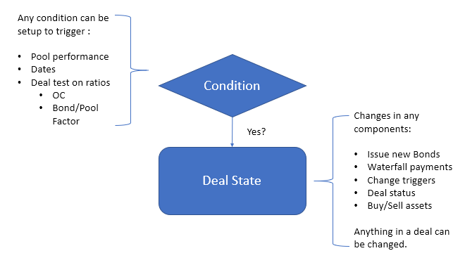

Modeling
***********

.. autosummary::
   :toctree: generated

Deal modeling is a process to build deal class with descriptive components follows:

* Dates info

  * Cutoff day / Closing Date / (Next/First) payment Date or series of custom dates
* Asset info 
  
  pool asset attributes, loan by loan or repline level data or projected cashflow as input
* Bond info
  
  bonds with different types and equity tranche
* Waterfall info 
  Describe the priority of payments when:

  * On Closing Date (Optional, One-off)
  * End of pool collection (Optional, reoccurring)
  * Distribution day for all the bonds and fees (reoccurring)
  * Clean up call (Optional, One-off)
* Triggers (Optional) 
  
  describe what may happened then what state changed should be performed in deal
* Liquidity Provider (Optional) 
  
  entities provides interest bearing/non-bearing support to shortfall of fee/interest or bond principal
* Hedges (Optional) 
  
  interest rate swap

Structure of a `Generic` deal 
==================================

There are couple must-have components in a deal:

.. graphviz::
    :name: sphinx.ext.graphviz
    :caption: deal components
    :alt: deal components
    :align: center
    
    digraph {
        rankdir = LR
        Deal -> DealDates [label="Must"]
        DealDates -> payFreq [label="Frequency distribution"]
        DealDates -> poolFreq [label="Frequency collect pool cash"]
        payFreq -> Waterfall [label="When to run"]
        poolFreq -> Waterfall [label="When to run"]
        Deal -> Pool [label="Must"]
        Deal -> "Collection Rule" [label="Must"]
        Pool -> "Collection Rule" [label="Generate Cash"]
        "Collection Rule" -> Accounts [label="Deposit proceeds"]
        Deal -> Accounts [label="Must"]
        Deal -> Waterfall [label="Must"]
        Accounts -> Waterfall [label="Source of funds"]
        Waterfall -> Bonds [label="Pay"]
        Waterfall -> Fees [label="Pay"]
        Deal -> Bonds [label="Must"]
        Deal -> Fees [label="Optional"]
        Deal -> Trigger [label="Optional"]
        Deal -> "Liquiditiy Provider" [label="Optional"]
        Deal -> Ledger [label="Optional"]
        Deal -> InterestRateSwap [label="Optional"]
    }

To model them in code:

.. code-block:: python

    from absbox.local.generic import Generic
    
    generalDeal = Generic(
        "Deal Name/Description"
        ,<Dates>
        ,<Asset/Pool Info>
        ,<Account info>
        ,<Bonds Info>
        ,<Fee Info>
        ,<Waterfall Info>
        ,<Collection Rule>
        ,<Call settings>
        ,<liquidation facilities>
        ,<custom data/formula>
        ,<triggers>
    )

.. _Generic ABS:

<New> : Model via a map
----------------------------

|:new:| Now we have a map-based syntax suguar ``mkDeal`` to create a deal without remembering the order of arguments passed into `Generic` class ! 

.. code-block:: python
  
    name = "TEST01"
    dates = {"cutoff":"2021-03-01","closing":"2021-06-15","firstPay":"2021-07-26"
        ,"payFreq":["DayOfMonth",20],"poolFreq":"MonthEnd","stated":"2030-01-01"}
    pool = {'assets':[["Mortgage"
            ,{"originBalance":2200,"originRate":["fix",0.045],"originTerm":30
              ,"freq":"Monthly","type":"Level","originDate":"2021-02-01"}
              ,{"currentBalance":2200
              ,"currentRate":0.08
              ,"remainTerm":20
              ,"status":"current"}]]}
    accounts = {"acc01":{"balance":0}}
    bonds = {"A1":{"balance":1000
                ,"rate":0.07
                ,"originBalance":1000
                ,"originRate":0.07
                ,"startDate":"2020-01-03"
                ,"rateType":{"Fixed":0.08}
                ,"bondType":{"Sequential":None}}
            ,"B":{"balance":1000
                ,"rate":0.0
                ,"originBalance":1000
                ,"originRate":0.07
                ,"startDate":"2020-01-03"
                ,"rateType":{"Fixed":0.00}
                ,"bondType":{"Equity":None}
                }}
                
    waterfall = {"amortizing":[
                    ["accrueAndPayInt","acc01",["A1"]]
                    ,["payPrin","acc01",["A1"]]
                    ,["payPrin","acc01",["B"]]
                    ,["payPrinResidual","acc01",["B"]]
                ]}
    collects = [["CollectedInterest","acc01"]
                ,["CollectedPrincipal","acc01"]
                ,["CollectedPrepayment","acc01"]
                ,["CollectedRecoveries","acc01"]]

    deal_data = {
        "name":name
        ,"dates":dates
        ,"pool":pool
        ,"accounts":accounts
        ,"bonds":bonds
        ,"waterfall":waterfall
        ,"collect":collects
        ,"status":"Revolving"
    }

    from absbox import mkDeal
    d = mkDeal(deal_data)  ## now a generic class created

Building Blocks 
==================

`Generic` is a class that represent `SPV` which contains the dates/liabilities/assets/waterfall/trigger/hedge information.

.. code-block:: python
    
    from absbox.local.generic import Generic

There are 5 reusable building blocks: ``<DatePattern>``, ``<Formula>``, ``<Condition>``, ``<Curve>``, ``<Pricing Method>``, all of them are being used in different components.

.. note::
   It looks boring at first place to learn the ``Building Blocks`` but these are essential.
   

DatePattern
-------------

``<DatePattern>`` is used to describe a series of dates .

* ``"MonthFirst"``  -> Every Jun 1, May 1 during the projection
* ``"MonthEnd"``  ->Every  Month End ,like Jan 31, Feb 28/29  during the projection
* ``"QuarterFirst"`` -> Every March 1 , Jun 1 , Sep 1 , Dec 1 during the projection
* ``"QuarterEnd"``  -> Every March 31, Jun 30, Sep 30, Dec 31 during the projection
* ``"YearFirst"`` -> Every Jan 1 during the projection
* ``"YearEnd"`` -> Every Dec 31 during the projection
* ``["MonthDayOfYear",M,D]`` -> Every a day of the year , like Feb 14 on every year during the projection
* ``["DayOfMonth",M]`` -> A day of the month , like 15 on each month during the projectionh
* ``["CustomDate","YYYY-MM-DD1","YYYY-MM-DD2"]`` -> a series of user defined dates
* ``["EveryNMonth","YYYY-MM-DD",N]`` -> a seriers day starts with "YYYY-MM-DD", then every other N months afterwards

Composite ``<DatePattern>``
^^^^^^^^^^^^^^^^^^^^^^^^^^^^^^

DatePatterns can be composed together:

* ``["After","YYYY-MM-DD",<datepattern>]`` -> a ``<datapattern>`` after "YYYY-MM-DD"(exclusive)
* ``["AllDatePattern",<datepattern1>,<datepattern2>.....]`` -> a union set of date pattern during the projection, like sum of dates
* ``["ExcludeDatePattern",<datepattern1>,<datepattern2>.....]`` -> build dates from 1st ``<datepattern1>`` and exclude dates from ``<datepattern2>,<datepattern3>``... 
* ``["OffsetDateDattern",<datepattern>,N]`` ->  build dates from ``<datepattern>`` and offset days by N ( positive N move dates to future) , negative N will move dates to past ) 

Formula 
---------

Structured product is using ``formula`` to define the amount of account transfer, principal paydown or fee pay limit etc.

``absbox`` use the concept of ``formula`` in an extreamly composable way, a ``formula`` can be a variable reference to deal attributes.

Balance Type 
^^^^^^^^^^^^^^
Bond 
"""""""
    * ``("bondBalance",)`` -> sum of all bond balance
    * ``("bondBalance","A","B")`` -> sum of balance of bond A and bond B
    * ``("originalBondBalance",)`` -> bond balance at issuance
    * ``("bondFactor",)``  -> bond factor
    * ``("bondDueInt","A","B")``  -> bond due interest for bond A and bond B
    * ``("lastBondIntPaid","A")``  -> bond last paid interest
    * ``("behindTargetBalance","A")``  -> difference of target balance with current balance for the bond A
    * ``("bondTxnAmt", None,"A")``  -> Total transaction amount of bond 'A'
    * ``("bondTxnAmt", "<PayInt:A>","A")``  -> Total transaction amount of interest payment bond 'A'
Pool 
"""""""
    * ``("poolBalance",)``  -> current pool balance
    * ``("originalPoolBalance",)``  -> pool original balance 
    * ``("currentPoolDefaultedBalance",)``  -> pool defaulted balance 
    * ``("cumPoolDefaultedBalance",)``  -> pool cumulative defaulted balance 
    * ``("cumPoolRecoveries",)`` -> pool cumulative recoveries
    * ``("poolFactor",)`` -> pool factor
    * ``("borrowerNumber",)`` -> number of borrower
Accounts
"""""""
    * ``("accountBalance",)`` -> sum of all account balance
    * ``("accountBalance","A","B")`` -> sum of account balance for "A" and "B"
    * ``("reserveGap","A","B")`` -> sum of shortfall of reserve amount of specified accounts
    * ``("accountTxnAmt",None,"A")`` -> total transaction amount of account "A"
    * ``("accountTxnAmt","<tag>","A")`` -> total transaction amount tagged with ``<tag>`` of account "A"
Expense
""""""""""
    * ``("feeDue","F1","F2")`` -> sum of fee due for fee "F1","F2"
    * ``("lastFeePaid","F1","F2")`` -> sum of fee last paid for fee "F1","F2"
    * ``("feeTxnAmt",None,"A")`` -> total transaction amount of fee "A"
LiquidationProvider 
""""""""""""""""""""""""
    * ``("liqCredit","F1","F2")`` -> sum of credit available from "F1" "F2"
    * ``("liqBalance","F1","F2")`` -> sum of credit drawn from "F1" "F2"

Ledger
""""""""""""
    * ``("ledgerBalance","L1","L2"..)`` -> sum of ledger balance
    * ``("ledgerTxnAmount","L1")`` -> sum of ledger transaction 
    * ``("ledgerTxnAmount","L1",<comment>)`` -> sum of ledger transaction with <comment>

`formula` can be used to refer to  Integer/Bool/Ratio type data as well

Integer Type
^^^^^^^^^^^^^^
    * ``("borrowerNumber",)`` -> number of borrower
    * ``("monthsTillMaturity","A")``  -> number of months till the maturity date of bond A

Ratio Type
^^^^^^^^^^^^
    * ``("bondFactor",)`` -> factor of bond
    * ``("poolFactor",)`` -> factor of pool
    * ``("cumuPoolDefaultedRate",)`` -> cumulative default rate of pool
    * ``("cumuPoolNetLossRate",)`` -> cumulative loss rate of pool

Bool Type
^^^^^^^
    * ``("trigger", loc ,<trigger name>)`` -> trigger with name ``<trigger name>`` at ``loc`` status
    * ``("isMostSenior","A",["B","C"])`` -> True if the bond "A" is oustanding and "B" and "C" are not outsanding
    * ``("status", <deal status>)`` -> True if current deal status is ``<deal status>``

Or `formula` can be an arithmetic calculation on itselfies.

Combination Type
^^^^^^^^^^^^^^
    * ``("factor", <Formula>, <Number>)`` -> multiply <Number> to a formula
    * ``("Max", <Formula>, <Formula>, ...)`` -> get the higher value in the list
    * ``("Min", <Formula>, <Formula>, ...)`` -> get the lower value in the list
    * ``("sum", <Formula>, <Formula>, ...)`` -> sum of formula values
    * ``("avg", <Formula>, <Formula>, ...)`` -> average of formula values
    * ``("abs", <Formula>)`` -> absolute value of formula value
    * ``("substract", <Formula>, <Formula>, ...)`` -> using 1st of element to substract rest in the list
    * ``("floorWith", <Formula1> , <Formula2>)`` -> get value of <formula1> and floor with <formula2>
    * ``("floorWithZero", <Formula> )`` -> get value of <formula1> and floor with 0
    * ``("floorCap", <Formula1>, <Formula2>, <Formula3> )`` -> use <Formula1> as floor, <Formula2> as cap, and use <Formula3> as value
    * ``("capWith", <Formula1> , <Formula2>)`` -> get value of <formula1> and cap with <formula2>
    * ``("constant", <Number>)``  -> a constant value
    * ``("custom", <Name of user define data>)`` -> use a custom data

Condition
------------

condition is a `boolean` type test

* it can be set up in reserve account to define different target reserve amount;
* or in the waterfall to run the distribution action only when the testing is passing;
* or it can be used in trigger to describle whether it will be triggered or not.

There are couple type of ``Condition`` to perform :

Compare with a number 
^^^^^^^^^^^^^^^^^^^^^^^

* ``[<formula>,">",val]`` -> true when <formula> greater than a value
* ``[<formula>,"<",val]`` -> true when <formula> less than a value
* ``[<formula>,">=",val]`` -> true when <formula> greater or equals to a value
* ``[<formula>,"<=",val]`` -> true when <formula> less or equals than a value
* ``[<formula>,"=",val]`` -> true when <formula> equals to a value

Compare with a curve
^^^^^^^^^^^^^^^^^^^^^^^^

* ``[<formula>,">",curve]`` -> true when <formula> greater than a curve
* ``[<formula>,"<",curve]`` -> true when <formula> less than a curve
* ``[<formula>,">=",curve]`` -> true when <formula> greater or equals to a curve
* ``[<formula>,"<=",curve]`` -> true when <formula> less or equals than a curve
* ``[<formula>,"=",curve]`` -> true when <formula> equals to a curve

Date Based Condition
^^^^^^^^^^^^^^^^^^^^
* ``["<",date]`` -> before certain date
* ``[">",date]`` -> after certain date
* ``["<=",date]`` -> On or beore certain date
* ``[">=",date]`` -> On or after certain Date

Deal Status 
^^^^^^^^^^^^^^^^^^^^
* ``["status", "Amortizing"]`` -> true if current status is `Amortizing`
* ``["status", "Revolving"]`` -> true if current status is `Revolving`
* ``["status", "Accelerated"]`` -> true if current status is `Accelerated`
* ``["status", "Defaulted"]`` -> true if current status is `Defaulted`
* ``["status", "PreClosing"]`` -> true if current status is `PreClosing`
* ``["status", "Ended"]`` -> true if current status is `Ended`

Nested Condition
^^^^^^^^^^^^^^^^^^^^
* ``["all",<condition>,<condition>....]`` -> true if all of <condition> is true
* ``["any",<condition>,<condition>....]`` -> true if any of <condition> is true

Curve
----------
``Curve`` was an abstract type of a series time-depend data points, which are being used in couple components:

* Bond Schedule Amortization balance
* Interest Rate assumpition 
* An curve for tartget reserve balance for account
* Threshold curve for trigger , like cumulative default rate
* A curve in custom data component.

To build a ``Curve`` , just a list of 2-element list 

.. code-block:: python

  [["2022-01-01",150],["2022-02-01",200]]

Pricing Method
----------------
``<Pricing Method>`` was an annotation used to price an ``Asset`` when waterfall action trying to liquidate assets or buy revolving assets.

there are couple ways of pricing

* Pricing by current balance 

  * ``["Current|Defaulted", a, b]``  -> Applies ``a`` as factor to current balance of a performing asset; ``b`` as factor to current balance of a defaulted asset
  * ``["Cuurent|Delinquent|Defaulted", a, b, c]`` -> same as above ,but with a ``b`` applies to an asset in deliquency.
  * ``["PV|Defaulted", a, b]`` ->  using ``a`` as pricing curve to discount future cashflow of performing asset while use ``b`` as factor to current balance of defautled asset.

* Pricing by PV of future cashflow of assets 

  * ``["PVCurve", ts]`` -> using `ts` as pricing curve to discount future cashflow of all assets.

Constants
--------------

Day Count
^^^^^^^^^^^^

* ``DC_30E_360``       -- ^ ISMA European 30S/360 Special German Eurobond Basis
* ``DC_30Ep_360``      -- ^ 30E+/360
* ``DC_ACT_360``       -- ^ Actual/360 , French
* ``DC_ACT_365``
* ``DC_ACT_365A``      -- ^ Actual/365 Actual 
* ``DC_ACT_365L``      -- ^ Actual/365 Leap Year
* ``DC_NL_365``        -- ^ Actual/365 No leap year
* ``DC_ACT_365F``      -- ^ Actual /365 Fixed, English
* ``DC_ACT_ACT``       -- ^ Actual/Actual ISDA 
* ``DC_30_360_ISDA``   -- ^ IDSA
* ``DC_30_360_German`` -- ^ Gernman
* ``DC_30_360_US``     -- ^ 30/360 US Municipal , Bond basis

Indexs
^^^^^^^^^

* ``LPR5Y``
* ``LPR1Y``
* ``LIBOR1M``
* ``LIBOR3M``
* ``LIBOR6M``
* ``LIBOR1Y``
* ``USTSY1Y``
* ``USTSY2Y``
* ``USTSY3Y``
* ``USTSY5Y``
* ``USTSY7Y``
* ``USTSY10Y``
* ``USTSY20Y``
* ``USTSY30Y``
* ``USCMT1Y``
* ``PRIME``
* ``COFI``
* ``SOFR1M``
* ``SOFR3M``
* ``SOFR6M``
* ``SOFR1Y``
* ``EURIBOR1M``
* ``EURIBOR3M``
* ``EURIBOR6M``
* ``EURIBOR12M``
* ``IRPH``
* ``SONIA`` 

Period
^^^^^^^^^^^
* ``Daily``
* ``Weekly``
* ``Monthly``
* ``Quarterly`` 
* ``SemiAnnually``
* ``Annually``

Components
============

Deal Dates
------------

Depends on the status of deal, the dates shall be modeled either in ``ongoing`` or ``preclosing``

.. graphviz::
    :name: sphinx.ext.graphviz
    :caption: how to model deal date
    :alt: how to model deal date
    :align: center

    digraph {
        b -> OngoingDates [label="Yes"]
        b -> PreCloseDates [label="Not yet"]
        PreCloseDates
        OngoingDates
        b [shape=diamond, label="Deal Closed ?"]
    }

PreClosing Deal dates
^^^^^^^^^^^^^^^^^^^^^

.. warning::
    if deal was modeled as `PreClosing` ,user has to include a ``new status`` in deal status ("PreClosing","<new status>"")

if it is ``preclosing`` stage ( the deal has not been issued yet )

``cutoff``
    All pool cashflow after `Cutoff Date` belongs to the SPV
``closing``
    fee/bonds starts from `Closing Date` 
``firstPay``
    First execution of payment waterfall
``stated``
    legal maturity date of the deal.
``poolFreq``
    a :ref:`DatePattern`, describle the dates that collect cashflow from pool
``payFreq``
    a :ref:`DatePattern`, describle the dates that distribution funds to fees and bonds.

date example
  .. code-block:: python

      {"cutoff":"2022-11-01"
      ,"closing":"2022-11-15"
      ,"firstPay":"2022-12-26"
      ,"stated":"2030-01-01"
      ,"poolFreq":"MonthEnd"
      ,"payFreq":["DayOfMonth",20]}

Ongoing Deal dates
^^^^^^^^^^^^^^^^^^^^^

if deal is ``ongoing`` ( which has been issued ), the difference is that in ``PreClosing`` mode, the projection will include an event of `OnClosingDate` which describe a sequence of actions to be performed at the date of `closing`

``collect``
    :code:`[<last pool collection date>,<next pool collection date>]`
``pay``
    :code:`[<last distribution payment date>,<next distribution payment date>]`
``poolFeq``
    a :ref:`DatePattern`, describle the dates that collect cashflow from pool
``payFeq``
    a :ref:`DatePattern`, describle the dates that distribution funds to fees and bonds.

.. code-block:: python

    {"collect":["2022-11-01"   # last pool collection date,
                ,"2022-12-01"] # next pool collection date
    ,"pay":["2022-11-15"   # last distribution payment date,
            ,"2022-12-15"] # next distribution date 
    ,"stated":"2030-01-01"
    ,"poolFreq":"MonthEnd"
    ,"payFreq":["DayOfMonth",20]
    }

``payFreq`` and ``poolFreq``
^^^^^^^^^^^^^^^^^^^^^^^^^^^^^^^

Usually pool collection date is prior to waterfall payment date in a single cycle.

* Pool cash proceeds were deposit to accounts at ``poolFreq`` date.
* Engine will pick a waterfall base on ``deal status`` to exectue waterfall on ``payFreq`` date 

``payFreq`` and ``poolFreq`` can be same day,and  engine will run pool collection before waterfall execution by default.

.. image:: img/payFreq_poolFreq.png
  :width: 600
  :alt: payFeq_poolFreq

Custom Defined Dates
^^^^^^^^^^^^^^^^^^^^^
User are free to feed in a series of custom defined pool collection date / bond payment dates to accomodate holidays etc.

.. code-block:: python

   {"poolCollection":["2023-01-31","2023-02-28"...]
   ,"distirbution":["2023-02-01","2023-03-01"...]
   ,"cutoff":"2022-11-21"
   ,"closing":"2023-01-01"}

Deal Status 
----------------

Deal status is a ``Tag`` to describe the current ``status`` of deal, it can be one of the following:

.. graphviz::
    :name: sphinx.ext.graphviz
    :caption: deal cycle
    :alt: deal cycle
    :align: center

    digraph {
      rankdir=LR;
      PreClosing -> Revolving [label="if revolving"]
      PreClosing -> Amortizing
      Revolving -> Amortizing
      Amortizing -> End
    }

The ``status`` is being used by engine to:

* pick up the ``right`` waterfall actions of the deal on dates of `payFreq`.
* can be used in ``waterfall`` or ``Condtion`` to condtionally execute actions or calculate a value

Deal Status Enums
^^^^^^^^^^^^^^^^^^^^^

``(PreClosing,"<new status>")``
  Deal is in pre-closing stage, which means the deal has not been issued yet. Make sure to include a ``new status`` which deal will enter after ``Closing Date``
``RampUp``
  Deal is ramping up to build assets
``Revolving``
  Deal is not amortizing yet, which means the deal is still in revolving stage.
``Amortizing``
  Deal is amortizing, the deal is picking ``Amortizing`` waterfall on distribution dates .
``Accelerated``
  Deal is in accelerated stage, which means the deal is picking ``Accelerated`` waterfall on distribution dates .
``Defaulted``
  Deal is in default stage, which means the deal is picking ``Defaulted`` waterfall on distribution dates .
``Ended`` 
  Means deal stop projection cashflow.

Fee/Expenses
--------------

syntax
  ``({fee name} , {fee description} )``, fees fall into types below :

  Optional fields in ``{fee description}``:

  * ``"feeStart"`` ->  the date fee start to become effective
  * ``"feeDueDate"`` -> the date when due amount was calculated 
  * ``"feeDue"`` ->    total oustanding due amount 
  * ``"feeLastPaidDate"`` -> the date when last paid

one-off fee
^^^^^^^^^^^^^^^^^^

with a oustanding balance and will be paid off once it paid down to zero

syntax
  `fixFee` : total oustanding fee amount to be paid

.. code-block:: python
  
  ("issuance_fee"
      ,{"type":{"fixFee":100}})

recurrance fee
^^^^^^^^^^^^^^^^

a fix amount fee which occurs by defined :ref:`DatePattern`

syntax
  `recurFee`:[ <DatePattern>,<new due amount on each DatePattern> ]

.. code-block:: python
    
   ,("rating_fee"
    ,{"type":{"recurFee":[["MonthDayOfYear",6,30],15]}})

percentage fee
^^^^^^^^^^^^^^^^^^^
pecentage fee, a fee type which the due amount depends on a percentage of :ref:`Formula`

like a fee is base on 

  * percentage of `pool balance`
  * a percentage of pool collection `interest`
  * a higher/lower amount of two `formula`
  * a sum of `formula` 
  * ...

syntax 
  `pctFee`:[ <Formula>,<percentage> ]

.. code-block:: python
  
  ("bond_service_fee"
      ,{"type":{"pctFee":[("bondBalance",),0.02]}})

annualized fee
^^^^^^^^^^^^^^^^

similar to `percentage fee` but it will use an annualized rate to multiply the value of :ref:`Formula`.
either reference to pool balance  or bond balance , etc.... it will accure type fee, which if not being paid, it will increase the due amount.

syntax 
  `annualPctFee`:[ <Formula>,<percentage> ]

.. code-block:: python
  
  ("servicer_fee"
      ,{"type":{"annualPctFee":["poolBalance",0.02]}})

custom fee flow
^^^^^^^^^^^^^^^^^^^

A user defined time series expenses, the date and amount can be customized.

like 100 USD at 2022-1-20 and incur other 20 USD at 2024-3-2

syntax 
  `customFee`:[ [<Date>,<Amount>] .... ]

.. code-block:: python
  
   ,("irregulargfee"
    ,{"type":{"customFee":[["2024-01-01",100]
                          ,["2024-03-15",50]]}})

count type fee
^^^^^^^^^^^^^^^^^^^

The fee due equals to a number multiply a unit fee. The number is a formula reference.

syntax 
  `numFee`:[ <DatePattern>, <Formula>, <Amount> ]

.. code-block:: python
  
   ,("borrowerFee"
    ,{"type":{"numFee":[["DayOfMonth",20],("borrowerNumber",),1]}}

target amount fee 
^^^^^^^^^^^^^^^^^^^^^^

The fee due amount is equal to ``max ( <Formula 1> - <Formula 2>,0)``

syntax
  `targetBalanceFee`:[<Formula 1> <Formula 2>]

.. code-block:: python 
   ("VAT"
     ,{"type":{"targetBalanceFee":[("poolBalance",),("bondBalance",)]))

Pool
---------

``Pool`` represents a set of assets ,which generate cashflows to support expenses and liabilities.

* it can either has a loan level ``asset`` or ``projected cashflow``
* other fields like ``issuance balance``, which will be supplimental to calculate certain value , like ``Pool Factor``

syntax
  ``Pool`` is modeled as map with following fields:

  * ``assets`` -> a list of assets
  * ``cashflow`` -> a list of projected cashflow
  * ``issuanceStat`` -> a map describe extra information of pool
  * ``extendBy`` -> :ref:`DatePattern`, used to provide extra dates of pool collection

.. warning::

  ``assets`` and ``cashflow`` are mutually exclusive, only one of them can be used in a pool

issuanceStat
^^^^^^^^^^^^^^^^
a map represents history information of a `ongoing` deal.

``IssuanceBalance``
  Issuance balance of deal, which used to be queried via `poolFactor`, `cumuPoolDefaultedRate` etc 

``HistoryDefaults``
  Cumulative Defaulted balance as of ``last collection`` date 
``HistoryDelinquency``
  Cumulative Delinquency balance as of ``last collection`` date 
``HistoryLoss``
  Cumulative Loss balance as of ``last collection`` date 
``HistoryRecoveries``
  Cumulative Recovery received as of ``last collection`` date 
``HistoryPrincipal``
  Cumulative Principal paid as of ``last collection`` date 
``HistoryPrepayment``
  Cumulative Prepayment paid as of ``last collection`` date 

Mortgage
^^^^^^^^^^^

`Mortgage` is a loan with level pay at each payment period.

``type``
  `type` field can be used to define either its `Annuity` type or `Linear` Type

  * `Level` -> `Annuity`,`French`
  * `Even` -> `Linear`

.. code-block:: python

  ["Mortgage"
    ,{"originBalance": 12000.0
      ,"originRate": ["fix",0.045]
      ,"originTerm": 120
      ,"freq": "Monthly"
      ,"type": "Level"
      ,"originDate": "2021-02-01"}
    ,{"currentBalance": 10000.0
      ,"currentRate": 0.075
      ,"remainTerm": 80
      ,"status": "Current"}]

Prepayment Penalty
""""""""""""""""""""""
If ``Prepayment Penalty`` was modeled and any prepayment will be yield extra cashflow to the pool.

``prepayPenalty``

  * ``{"byTerm":[<term>,<rate1>,<rate2>]}`` 
  
    first <term> periods, prepayment will use rate1 ,otherwise use rate2
  * ``{"fixAmount":[<amount>,<term>]}``
  
    before <term> periods, prepayment will use <amount> as penalty, otherwise 0
  * ``{"fixAmount":[<amount>]}``

    prepayment will use <amount> as penalty
  * ``{"fixPct":[<pct>,<term>]}``
  
    before <term> periods, prepayment will use <pct> * prepayment amount as penalty, otherwise 0
  * ``{"fixPct":[<pct>]}``
  
    prepayment will use <pct>* prepayment amount as penalty
  * ``{"sliding":[<pct>,<step>]}``
  
    penalty rate is declining by <step>  each period
  * ``{"stepDown":[(<first N term>,<rate1>),....]}``

    penalty rate is being used by different term interval
.. code-block:: python

  ["Mortgage"
  ,{"originBalance": 12000.0
    ,"originRate": ["fix",0.045]
    ,"originTerm": 36
    ,"freq": "Monthly"
    ,"type": "Level"
    ,"originDate": "2021-02-01"
    ,"prepayPenalty":{"byTerm":[15,0.1,0.2]}
    }
  ,{"currentBalance": 10000.0
    ,"currentRate": 0.075
    ,"remainTerm": 24
    ,"status": "Current"}]

ARM 
""""""

`ARM` is a type of `Mortgage` that has one more field `arm` to describe the rate adjust behavior of the loan.

``arm``
  describe the initial rate period of `AdjustRateMortgage`

  * ``initPeriod`` -> Required
  * ``firstCap`` -> Optional
  * ``periodicCap`` -> Optional
  * ``lifeCap`` -> Optional
  * ``lifeFloor`` -> Optional

.. code-block:: python

    ["AdjustRateMortgage"
    ,{"originBalance": 240.0
      ,"originRate": ["floater"
                      ,0.03
                      ,{"index":"LIBOR1M"
                        ,"spread":0.01
                        ,"reset":["EveryNMonth","2023-11-01",2]}]
      ,"originTerm": 30 ,"freq": "monthly","type": "level"
      ,"originDate": "2023-05-01"
      ,"arm":{"initPeriod":6,"firstCap":0.015,"periodicCap":0.01,"lifeCap":0.1,"lifeFloor":0.15} }
    ,{"currentBalance": 240.0
      ,"currentRate": 0.08
      ,"remainTerm": 19
      ,"status": "current"}]

Loan
^^^^^^^^^^
`Loan` is type of asset which has interest only and a lump sum principal payment at end

``type``

  * ``i_p`` : interest only in all periods,the principal balance repayment at last term
  * ``schedule`` : principal repayment schdule

.. code-block:: python

  ["Loan"
    ,{"originBalance": 80000
      ,"originRate": ["floater",0.045,{"index":"SOFR3M"
                                      ,"spread":0.01
                                      ,"reset":"QuarterEnd"}]
      ,"originTerm": 60
      ,"freq": "SemiAnnually"
      ,"type": "i_p"
      ,"originDate": "2021-03-01"}
    ,{"currentBalance": 65000
      ,"currentRate": 0.06
      ,"remainTerm": 48
      ,"status": "Current"}]

Schedule Repayment
""""""""""""""""""""

.. versionadded:: 0.22

.. code-block:: python

  ["Loan"
    ,{"originBalance": 80000
      ,"originRate": ["floater",0.045,{"index":"SOFR3M"
                                      ,"spread":0.01
                                      ,"reset":"QuarterEnd"}]
      ,"originTerm": 3
      ,"freq": "SemiAnnually"
      ,"type": ("Schedule",[["2021-10-10",20000]
                            ,["2022-01-10",20000]
                            ,["2022-10-10",40000]
                           ])
      ,"originDate": "2021-03-01"}
    ,{"currentBalance": 80000
      ,"currentRate": 0.06
      ,"remainTerm": 3
      ,"status": "Current"}]

Lease
^^^^^^^^^

`Lease` is an asset with have evenly distributed rental as income or step up feature on the rental over the projection timeline.

.. code-block:: python

  ["Lease"
   ,{"fixRental": 12.0
    ,"originTerm": 96
    ,"freq": ["DayOfMonth",15]
    ,"originDate": "2022-01-05"
    ,"status":"Current"
    ,"remainTerm":80}]

step up type lease which rental will increase by pct after each accrue period

.. code-block:: python

  ["Lease"
    ,{"initRental": 24.0
    ,"originTerm": 36
    ,"freq": ["DayOfMonth",25]
    ,"originDate": "2023-01-01"
    ,"status":"Current"
    ,"remainTerm":30
    ,"accrue": ["DayOfMonth",1]
    ,"pct": 0.05}]

or user can specify the vector for the rental change 

.. code-block:: python

  ["Lease"
   ,{"initRental": 24.0
    ,"originTerm": 36
    ,"freq": ["DayOfMonth",25]
    ,"originDate": "2023-01-01"
    ,"status":"Current"
    ,"remainTerm":30
    ,"accrue": ["DayOfMonth",3]
    ,"pct": [0.05,0.065,0.06,-0.07]}]

Installment
^^^^^^^^^^^^^^

`Installment` is an asset which has evenly distributed fee and principal

``type``

  * ``f_p`` : evenly distributed fee and principal

.. code-block:: python

  ["Installment"
   ,{"originBalance": 1000.0
    ,"feeRate": ["fix",0.01]
    ,"originTerm": 12
    ,"freq": "Monthly"
    ,"type": "f_p"
    ,"originDate": "2022-01-01"}
    ,{"status": "current"
      ,"currentBalance":1000
      ,"remainTerm":10}]

Fixed Asset
^^^^^^^^^^^^^^^^^

.. versionadded:: 0.22.3

``Fixed Asset`` is a generalized concept to model couple different types of fixed asset, which genreate cashflow :

* ``capacity`` : max unit generated by the asset in a given period,multiply `util` rate from assumption
* ``unite price`` : input from assumption 

this type of asset can be used to model : `Hotel room` / `Solar Panel` / `EV Charger Station` or anything which has a cap on capacity and it would generate something to sell.

``capacity``
  can be a fixed value or a curve which depends on ``remainTerm``, which suggests the production would decrease with time, for example, the `Solar Panel` . or a fixed value, like a `Hotel Room`

``amortize``
  either ``Straight`` or ``DecliningBalance`` .

.. code-block:: python

  assets = [["FixedAsset" ,{"start":"2023-11-01","originBalance":100_0000,"originTerm":120
                            ,"residual":10_0000,"period":"Monthly","amortize":"Straight"
                            ,"capacity":("Fixed",24*25*120*30)}
                          ,{"remainTerm":120}]]

.. warning::

  To project cashflow , user MUST set assumption for this type asset.

Collection Rules 
-------------------

`Colelction Rules` defines *how* ``SPV`` / ``Transaction`` / ``Deal`` collect *proceeds* from ``Pool``

Proceeds
^^^^^^^^^^

``Proceeds`` refer to cash yields from pool:

.. list-table:: Proceeds By Types
   :header-rows: 1

   * - Asset Type
     - Principal
     - Interest
     - Prepayment
     - Recovery
     - Rental
   * - Mortgage
     - Yes
     - Yes
     - Yes
     - Yes
     - No
   * - Installment
     - Yes
     - Yes
     - Yes
     - Yes
     - No
   * - Loan
     - Yes
     - Yes
     - Yes
     - Yes
     - No
   * - Lease
     - No
     - No
     - No
     - No
     - Yes

Allocation Rule
^^^^^^^^^^^^^^^^

The rule was defined as a *List*, each element is a *List* with 2 elements.

* 1st element describes the ``Proceeds`` 
* 2nd element describes `percentage` to be allocated to each account

  * if it is just an `account name`,then 100% of ``Proceeds`` will be flowed into that account

syntax
  * ``[<Proceeds from pool>, <Account to be depsit>]``
  * ``[<Proceeds from pool>, [[<Allocation ration1>,<Account01>],[<Allocation ration2>,<Account02>] ]``

exmaple:

.. code-block:: python 

  [["CollectedInterest",[[0.8,"acc01"],[0.2,"acc02"]]] 
    # 80% of interest will be allocated to acc01
    # 20% of interest will be allocated to acc02
    ,["CollectedPrincipal",[[0.8,"acc01"],[0.2,"acc02"]]]
    ,["CollectedPrepayment","acc01"] 
    # 100% of prepayment will be allocated to acc01
    ,["CollectedRecoveries","acc01"]]

Accounts
---------

Accounts serves as intermediary to control flow of cash between assets and liabilities of SPV.

There are two types of `Account`:

  * ``Bank Account`` -> which used to collect money from pool and pay out to fees/bonds
  * ``Reserve Account`` -> with one addtional attribute to ``Bank Account`` , specifies target reserve amount of the account

.. list-table:: Account By Types
   :widths: 15 10 30
   :header-rows: 1

   * - Account Type
     - Reserve Target
     - Interest Bearing
   * - Bank Account
     - No
     - Optional
   * - Reserve Account
     - Yes
     - Optional

syntax
  ``({account name},{account description})``

Bank Account
^^^^^^^^^^^^^^^^^^

.. code-block:: python

  (("principalAccount",{"balance":0})
   ,("repaymentAccount",{"balance":0}))

Reserve Account
^^^^^^^^^^^^^^^^^^

There is one extra attribute to set for ``Reserve Account`` : ``type``

  * Fix Amount： a single reserve amount 
  
    .. code-block:: python

      ("ReserveAccountA",{"balance":0
                         ,"type":{"fixReserve":1000}})

  * Formula： the target reserve amount is derived from a :ref:`Formula` , like 2% of pool balance
  
    .. code-block:: python

      ("ReserveAccountB",{"balance":0
                         ,"type":{"targetReserve":[("poolBalance",),0.015]}})

  * Nested Formula, the target reserve amount is base on higher or lower of two formula 

  * Conditional amount starts with ``When``, the target reserve amount depends on :ref:`Condition`:
    
    * Use 1st formula if condition is true
    * Use 2nd formula if condition is false
  
    .. code-block:: python

      ("ReserveAccountC",{"balance":0
                         ,"type":{"max":[
                                   {"targetReserve":[("poolBalance",),0.015]}
                                   ,{"fixReserve":100}]})

      ("ReserveAccountD",{"balance":0
                         ,"type":{"min":[
                                    {"targetReserve":[("poolBalance",),0.015]}
                                    ,{"fixReserve":100}]})

      ("ReserveAccountE",{"balance":0
                         ,"type":{"min":[
                                    {"max":[{"targetReserve":[("poolBalance",),0.015]}
                                           ,{"fixReserve":100}]}
                                    ,{"fixReserve":150}]})

      ("ReserveAccountF",{"balance":0
                         ,"type":{"when":[
                                     [("bondBalance",">",0]
                                    ,{"max":[{"targetReserve":[("poolBalance",),0.015]}
                                           ,{"fixReserve":100}]}
                                    ,{"fixReserve":150}]})

      ("ReserveAccountG",{"balance":0
                         ,"type":{"when":[
                                     ["any"
                                       ,[("bondBalance",">",0]
                                       ,[("poolFactor","<",0.5]]
                                    ,{"max":[{"targetReserve":[("poolBalance",),0.015]}
                                           ,{"fixReserve":100}]}
                                    ,{"fixReserve":150}]})

Model Reinvestment
^^^^^^^^^^^^^^^^^^^^^^^^^^

To model the interest or short-term investment income in the account.

* fix rate syntax: 

  ``{"period": <date Pattern>, "rate": <number>, "lastSettleDate":<date>}``

* floater rate syntax: 

  ``{"period": <date Pattern>, "index": <index name>, "spread": <number>, "lastSettleDate":<date>}``

.. code-block:: python

  ("ReserveAccountA",{"balance":0
                    ,"type":{"fixReserve":1000}
                    ,"interest":{"period":"QuarterEnd"
                                 ,"rate":0.05
                                 ,"lastSettleDate":"2022-11-02"}})

  ("InvestmentAccountA",{"balance":0
                    ,"type":{"fixReserve":1000}
                    ,"interest":{"period":"QuarterEnd"
                                 ,"index":"SOFR3M"
                                 ,"spread":0.001
                                 ,"lastSettleDate":"2022-11-02"}})

Bonds/Tranches
---------------

Bonds/Tranches serves as a ``Liability`` in the SPV, with two components to model:

* Interest
* Principal

.. graphviz::
    :name: sphinx.ext.graphviz
    :caption: how to model bond
    :alt: how to model bond
    :align: center

    digraph {
      "model bond" -> principal
      "model bond" -> interest
      principal -> "Sequential"
      principal -> "Schdule Amortization"
      principal -> "Lock out"
      principal -> "Equity"
      interest -> "Fix Rate"
      interest -> "Floater Rate"
      interest -> "Step up Rate"
    }

syntax
    ``({bond/tranche name},{bond/tranche description})``

optional fields:
  * ``maturityDate`` : maturity date of bond
  * ``lastAccrueDate`` : last date of interest accrued
  * ``dueInt`` : due interest amount already accrued

Interest
^^^^^^^^^^^

there are 3 types of `Interest` settings for bonds

Fix Rate 
""""""""""""

The bond will use an annualized fixed rate during till maturity, with option of day count convention.

syntax
    :code:`"rateType":{"fix":0.0569}`

    :code:`"rateType":{"fix":0.0569,"dayCount":"DC_ACT_365"}`

Float Rate 
""""""""""""""""

The bond will use an initial floater rate , with an index and spread, and a reset frequency, with option of day count convention.

syntax
    :code:`"rateType":{"floater":[<start rate>, <index>, <spread>, <reset dates>]}`
    
    :code:`"rateType":{"floater":[0.05, "SOFR1Y",-0.0169,"MonthEnd"]}`
    
    :code:`"rateType":{"floater":[0.05, "SOFR1Y",-0.0169,"MonthEnd"], "dayCount":"DC_ACT_365"}`
    

Step-Up Rate
""""""""""""""

The bond will use a step up rate with:

* a base rate which will be used "When"
* a spread which will be added to base rate 
* a condtion ``When`` which describle  when to start steping up and the frequency.

syntax
    :code:`"rateType":{"StepUp":0.06,"Spread":0.01,"When":["After","2023-05-01","YearEnd"]}`

Principal 
^^^^^^^^^^^
there are 4 types of `Principal` for bonds/tranches

  * ``Sequential``： can be paid down as much as its oustanding balance
  * ``PAC``： Balance of bond can only be paid down by a predefined schedule
  * ``Lockout``： Principal won't be paid after lockout date
  * ``Equity``：  No interest and shall serve as junior tranche

Sequential 
"""""""""""""
A bond with will receive principal till it's balance reduce to 0.

.. code-block:: python

    ("A1",{"balance":3_650_000_000
           ,"rate":0.03
           ,"originBalance":3_650_000_000
           ,"originRate":0.03
           ,"startDate":"2020-01-03"
           ,"rateType":{"floater":[0.05,"SOFAR1Y",-0.0169,"MonthEnd"]}
           ,"bondType":{"Sequential":None} })
 
PAC
"""""""""""""
A bond with target amortize balances, it will stop recieving principal once its balance hit the targeted balance 

.. code-block:: python
 
  ("A1",{"balance":1000
       ,"rate":0.07
       ,"originBalance":1000
       ,"originRate":0.07
       ,"startDate":"2020-01-03"
       ,"rateType":{"fix":0.08}
       ,"bondType":{"PAC":
                     [["2021-07-20",800]
                     ,["2021-08-20",710]
                     ,["2021-09-20",630]
                     ,["2021-10-20",0]
                     ]}})

Lockout
"""""""""""""
A bond with ``Lockout`` type is used to setup bond with only recieve principal after the `lockout date`

This bond only get principal repayed starting at `2021-09-20`

.. code-block:: python

  ("A1",{"balance":1000
        ,"rate":0.07
        ,"originBalance":1000
        ,"originRate":0.07
        ,"startDate":"2020-01-03"
        ,"rateType":{"fix":0.08}
        ,"bondType":{"Lockout":"2021-09-20"}})
 
Equity
"""""""""""""

``Equity`` type is used to model junior or equity slice of liabilites of the SPV

          
.. code-block:: python

     ,("R",{"balance":900_883_783.62
           ,"rate":0.0
           ,"originBalance":2_123_875_534.53
           ,"originRate":0.00
           ,"startDate":"2020-01-03"
           ,"rateType":{"fix":0.0}  
           ,"bondType":{"Equity":None} })

Waterfall
-------------

Waterfall means a *list* of ``Action`` to be executed. A Deal may have more than one waterfalls.

It was modeled as a map, with key as identifier to distinguish different type of waterfall.

* ``"amortizing"`` -> will be picked when deal status is `Amortizing`
* ``("amortizing", "accelerated")`` -> will be picked when deal status is `Accelerated`
* ``("amortizing", "defaulted")`` -> will be picked when deal status is `Defaulted`
* ``"endOfCollection"`` -> will be exectued at the end of each collection period
* ``"default"`` -> the default waterfall to be executed if no other waterfall applicable
* ``"cleanUp"`` -> will be exectued *once* when deal is being clean up call
* ``"closingDay"`` -> will be exectued *once* at the `Day of Closing` if deal status is `PreClosing`

.. image:: img/waterfall_in_deal_runt.png
  :width: 500
  :alt: waterfall_run_loc

.. list-table:: When Waterfall Run
   :header-rows: 1
   
   * - waterfall key
     - require deal status
     - times to run
   * - ``amortizing``
     - deal status is `Amortizing`
     - every distribution day
   * - ``(amortizing, accelerated)``
     - deal status is `Accelerated`
     - every distribution day
   * - ``(amortizing, defaulted)``
     - deal status is `Defaulted`
     - every distribution day
   * - ``endOfCollection``
     - any deal status
     - every day of collection period
   * - ``cleanUp``
     - any deal status
     - once deal was called
   * - ``closingDay``
     - deal status is `PreClosing`
     - once deal exits `PreClosing` status

example:
  .. code-block:: python

    {"amortizing":[
        ["payFee","acc01",['trusteeFee']]
        ,["payInt","acc01",["A1"]]
        ,["payPrin","acc01",["A1"]]
        ,["payPrin","acc01",["B"]]
        ,["payResidual","acc01","B"]]
      ,"cleanUp":[]
      }

.. warning::
   
   Make sure there are waterfall to be run if deal status changed. Otherwise the deal won't do anything. ie. if there is trigger change in deal,make sure there is a corresponding waterfall modeled for that status.

Action
  ``Action`` is a python list, whose elements annoates the parameter of action. In most of cases, 

  * the *first element* of list is the name of action, 
  * *rest of elements* are describing the fund movements(fund source and fund target)/ state change like update trigger status / fee accrual /bond interest accrual.

Fee 
^^^^^^

Calc Fee 
  calculate the due balance of a fee till the date of action  

  syntax
    ``["calcFee", <Fee1> , <Fee2> ... ]``
  
PayFee
  Pay to a fee till due balance is 0 if there is a due balance otherwise no actual payment happen.

  syntax
    ``["payFee", {Account}, [<Fee>]]``

    *  ``{Account}`` -> Using the available funds from a single account.
    *  ``[<Fee>]`` -> Pay the fees in the list on pro-rata basis

  Using one more map to limit the amount to be paid

  syntax
    ``["payFee", {Account}, [<Fee>], {'limit':<limit> , 'support':<supports>}]``
  
  * ``<limit>``
  
    * ``{"balPct": 0.6}`` , pay up to 60% of due amount
    * ``{"balCapAmt": 500}`` ,  pay up to 500.
    * ``{"formula": <formula> }``, pay up the <formula> 
 
    ie. ``["payFee", "CashAccount", ["ServiceFee"], {"balPct":0.1}]``
  
  If there is a shortfall from ``{Account}`` to pay, the shortfall can be supported by other accounts or liquidity provider.

  syntax
    ``["payFee", {Account}, [<Fee>], {'support':<supports>}]``
  
    * supported by accounts : 
  
      *  ``["account","accountName"]``
    * supported by liquidity provider: 
    
      *  ``["facility","liquidity provider name"]``
    * supported by mix 
    
      *  ``["multiSupport" ,["account","accountName1"] ,["facility","liquidity provider name"] ,["account","accountName2"]]``

Calc Fee and Pay
  calculate the due balance of a fee and pay it till due balance is 0

  syntax
    ``["calcAndPayFee", {Account}, [<Fee>]]``
    ``["calcAndPayFee", {Account}, [<Fee>], {'limit':<limit> , 'support':<supports>}]``

Pay Fee Residual
  pay to a fee regardless the amount due

  syntax  
    ``["payFeeResidual", {Account}, {Fee} ]``
    ``["payFeeResidual", {Account}, {Fee}, <limit> ]``

Bond
^^^^^^

Calc Bond Int
  calculate the due balance of a bond
    
  syntax
    ``["calcInt", <Bond1> , <Bond2> ... ]``
 
PayInt 
  pay interset to a bond till due int balance is 0

  syntax
    ``["payInt", {Account}, [<Bonds>] ]``
    ``["payInt", {Account}, [<Bonds>], m ]``
    `m`is just a map same in the `payFee` , which has keys :

      * ``limit`` -> same as `payFee`
      * ``support`` -> same as `payFee`
  
AccrueAndPayInt 
  accrue interest and pay interset to a bond till due int balance is 0

  syntax
    ``["accrueAndPayInt", {Account}, [<Bonds>] ]``
    ``["accrueAndPayInt", {Account}, [<Bonds>], m ]``
    `m` is a map with 

      * ``limit`` -> same as `payFee` , describe how much to be paid
      * ``support`` -> same as `payFee`
    
PayPrin 
  pay principal to a bond till due principal balance is 0

  syntax
    ``["payPrin", {Account}, [<Bonds>] ]``
    ``["payPrin", {Account}, [<Bonds>], m ]``
    `m`is just amp same in the `payFee` , which has keys :

      * ``limit`` -> same as `payFee`
      * ``support`` -> same as `payFee`
 
  the ``limit`` is the magic key to make principal payment more versatile. User can control the amount to be paid via a :ref:`Formula` ie.
  
  (from deal: Autoflorence)
      the target amount is ``(end pool balance - (end pool balance * subordination percentage(12%)))``
        
        .. code-block:: python

          ["payPrin","SourceAccount","A"
                    ,{"formula": ("substract"
                                    ,("poolBalance",)
                                    ,("factor"
                                        ,("poolBalance",), 0.12))}]
  
PayPrinResidual 
  pay principal to a bond regardless its due principal balance
    
  syntax
    ``["payPrinResidual", {Account}, <Bond> ]``
  
PayIntResidual 
  pay interest to a bond regardless its interest due.

  syntax  
    ``["payIntResidual", {Account}, <Bond> ]``
    ``["payIntResidual", {Account}, <Bond>, <Limit> ]``
  
  The ``<Limit>`` can be used to describe limit amount via ``{"formula":<formula>}`` 
  
Account
^^^^^^^^^

Transfer 
  transfer all the funds to the other account 
   
  syntax
    ``["transfer", {Account}, {Account}]``
  
  transfer funds to the other account by ``<Limit>``
  
  syntax
    ``["transfer", {Account}, {Account}, <limit> ]``
    
  ``<limit>`` could be 

    * ``{"balCapAmt":100}`` -> transfer up to 100
    * ``{"balPct":0.1}`` -> transfer up to 10% of source account 
    * ``{"formula":<formula>}`` -> transfer up to the value of formula
    * ``{"reserve":"gap"}`` -> transfer till reserve amount of *target* account is met
    * ``{"reserve":"excess"}`` -> transfer till reserve amount of *source* account is met

Buy & Sell Assets 
^^^^^^^^^^^^^^^^^^^^^^^

Liquidation 
  sell the assets and deposit the proceeds to the account
   
  syntax
    ``["sellAsset", {pricing method}, {Account}]``
      
Buy Asset 
  use cash from an account to buy assets.
  
  syntax 
    ``["buyAsset",{pricing method}, {Account}, {limit}]``

    ``limit`` can be either a :ref:`Formula` or a Cap Amount
      

Liquidtiy Facility 
^^^^^^^^^^^^^^^^^^^

``Liquidity Facility`` behaves like a 3rd party entity which support the cashflow distirbution in case of shortage. It can deposit cash to account via ``liqSupport``, with optinal a ``<limit>``.

Draw Cash to Account
  syntax
    ``["liqSupport", <liqProvider>, "account", <Account Name>, <Limit>]``
  
Pay fee 
  syntax
    ``["liqSupport", <liqProvider>, "fee", <Fee Name>, <Limit>]``
  
Pay interest/principal to bond
  pay principal or interest to bond.

  syntax
    ``["liqSupport", <liqProvider>, "interest", <Bond Name>, <Limit>]``
    ``["liqSupport", <liqProvider>, "principal", <Bond Name>, <Limit>]``

Liquidity Repay 
  pay back to liquidity provider till its oustanding balance is 0

  syntax:
    * ``["liqRepay","bal", <Account>, <liqProvider>, <Limit>]``
    * ``["liqRepay","int", <Account>, <liqProvider>, <Limit>]``
    * ``["liqRepay","premium", <Account>, <liqProvider>, <Limit>]``

Compensation 
  Use all cash from the account and pay back to liquidity provider as compensation,no limit amount.
  
  syntax 
    ``["liqRepayResidual", <Account>, <liqProvider>]``

Conditional Action
^^^^^^^^^^^^^^^^^^^^

There are two types of `Conditional Action`, which are same in with "IF" / "IF-ELSE" clause in programming language

``If``
  waterfall actions follows will be executed if certain ``Condtion`` is met.

  .. code-block:: python 
    
    ["If",<conditon>
         ,<Action1>,<Action2>....]

``IfElse``
  first list of actions will be executed if ``condtion`` was met , otherwise , second list of actions will be executed

  .. code-block:: python 
    
     ["IfElse",<conditon>
              ,[<Action1>,<Action2>....] # executed if condition is met/True
              ,[<Action1>,<Action2>....] # executed if condition is not met/False
              ]

Inspect Variables during waterfall 
^^^^^^^^^^^^^^^^^^^^^^^^^^^^^^^^^^^^^

.. versionadded:: 0.22

this action will query the :ref:`Formula` and tag with <Comment>("optional string") save to result. 
To read the result, please refer to :ref:`View Variables In Waterfall`

syntax
  .. code-block:: python

    ["inspect",<Comment>,<Formula1>,<Formula2>.....]

Booking Ledger
^^^^^^^^^^^^^^^^^

This action would book a transaction to the ledger

syntax
  .. code-block:: python

    ["bookBy",<bookType>]

``bookType``

  * ``["PDL",<default>,[(<ledger name>,<cap>)....] ]``
  
    Typically this was used to model `Principal Deficiency Ledger`.

    * ``<default>`` -> definition of `default` of asset balance, ``("cumPoolDefaultedBalance",)``
    * ``[("Bond-B-Ledger",("bondBalance","B"))...]`` -> book the defaults with cap of ``current balance`` of tranche B to `Ledger`: "Bond-B-Ledger"
  * ``["AccountDraw",<ledger name>]``
  
    It was used in ``Support``,when there is insufficent interest or fee payment from account A and account B cures the shortfall ,that amount draw from account B was call "Account Draw" and booked in the ledger.
  * ``["ByFormula",<ledger name>,<formula>]``

    The most generic booking type ,which just book a ``<formula>`` value to ledger ``<ledger name>``

Trigger
-----------

`Trigger` is a generalized concept in `absbox` / `Hastructure`, it is not limited to <pool performance> related design to protect tranches but a border concpet as below:

There are 4 fields in Triggers:

  * ``Condition`` -> it will fire the trigger effects, when :ref:`Condition` is met
  * ``Effects`` -> what would happen if the trigger is fired
  * ``Status`` -> it is triggered or not 
  * ``Curable`` -> whether the trigger is curable

Syntax of trigger
^^^^^^^^^^^^^^^^^^^^^^

it's optional to specify ``Location``

.. code-block:: python 

  {"BeforeCollect": # optional
    {"triggerName1":
      {"condition":..
      ,"effects":..
      ,"status":..
      ,"curable":..}
      ......
    }
  ,"AfterCollect": # optional
    {}
  ,"BeforeDistribution": # optional 
    {}
  ,"AfterDistribution": # optional
    {}
  }

When to run trigger
^^^^^^^^^^^^^^^^^^^^^^
  
  Trigger can run at 5 point of time.
  
  * Start/End of each Pool Collection Day -> ``BeforeCollect`` / ``AfterCollect``
  * Start/End of each Distribution Day    -> ``BeforeDistribution`` / ``AfterDistribution``
  * During any point of waterfall 

.. image:: img/trigger_in_deal_run.png
  :width: 600
  :alt: trigger_loc

Why there are 5 points of time to run trigger ? 
    Because , when there is a ``Formula`` ,it may reference to bond balance ,but the bond balance varies in different point of time : the balance in ``BeforeDistribution``  is different from ``AfterDistirbution`` as the bond maybe paid down.

Conditons of a trigger
^^^^^^^^^^^^^^^^^^^^^^^^^

Magically, condition of a trigger is just a :ref:`Condition` from the very begining ! We just reuse that component.

Effects/Consequence of a trigger
^^^^^^^^^^^^^^^^^^^^^^^^^^^^^^^^^

Change Deal Status
  Trigger will update the `state` of a deal, like:

    * convert `revolving` to `amortizing`
    * convert `amortizing` to `accelerated`
    * convert `amortizing` to `defaulted`

  .. code-block:: python
    
    "effects":("newStatus","Amortizing") # change deal status to "Amortizing"
    "effects":("newStatus","Accelerated") # change deal status to "Accelerated"
    "effects":("newStatus","Defaulted") # change deal status to "Defautled"

  Once the `state` of deal changed, the deal will pick the corresponding waterfall to run at distribution days.

Accure fees 
  Accure fees if it was triggered

  .. code-block:: python
    
    "effects":["accrueFees","feeName1","feeName2",...]

Change Target Reserve 
  Change reserve target formula of a reserve account

  .. code-block:: python
    
    "effects":["newReserveBalance","accName1",{"fixReserve":1000}]
    "effects":["newReserveBalance","accName1",{"targetReserve":["......"]}]

Add a trigger
  Create a new trigger 

.. code-block:: python
  
  "effects":[("newTrigger"
              ,{"condition":...
               ,"effects":...
               ,"status":...
               ,"curable":...})]

Combination of above
  a list of above can be combined together with keyword ``Effects``

.. code-block:: python
  
  "effects":["Effects"
             ,<effect 1>
             ,<effect 2>
             ,....]

Examples  

.. code-block:: python

    {
      "BeforeCollect":[]
      ,"AfterCollect":[
        {"condition":[("cumPoolDefaultedRate",),">",0.05]
        ,"effects":("newStatus","Defaulted")
        ,"status":False
        ,"curable":False}
      ]
      ,"BeforeDistribution":[
        {"condition":[">=","2025-01-01"]
        ,"effects":("newStatus","Defaulted")
        ,"status":False
        ,"curable":False}
      ]
      ,"AfterDistribution":[
        {"condition":[("bondFactor",),"<=",0.1]
        ,"effects":("newStatus","Accelerated")
        ,"status":False
        ,"curable":False}
      ]
      }
    }

    #a list of triggers effects
    {
      "AfterCollect":[
        {"condition":[("cumPoolDefaultedRate",),">",0.05]
        ,"effects":("Effects"
                    ,("newStatus","Defaulted")
                    ,("accrueFees","feeA","feeB"))
        ,"status":False
        ,"curable":False}
      ]
    }

    # ALL and ANY logic of triggers ( and they can nested toghter ! )
    ,{"AfterCollect":[
        {"condition":["any"
                       ,[("cumPoolDefaultedRate",),">",0.05]
                       ,[">","2021-09-15"]]
        ,"effects":("newStatus","Accelerated")
        ,"status":False
        ,"curable":False}
        ]}

    ,{"AfterCollect":[
        {"condition":["all"
                      ,[("cumPoolDefaultedRate",),">",0.05]
                      ,[">","2021-09-15"]]
        ,"effects":("newStatus","Accelerated")
        ,"status":False
        ,"curable":False}
        ]}

.. seealso::
  
  Example :ref:`Formula based trigger` 

Query trigger during run
^^^^^^^^^^^^^^^^^^^^^^^^^^^

By specify in the `inspect`, user are able to view the status of trigger during the run.

.. seealso::

  To get status of trigger, see query on trigger status :ref:`Bool Type`

Liquidity Provider
---------------------

`Liquidity Provider` is an external entity which can be used as a line of credit/insuer. 

If there is a shortage on fee or interest or principal, user can setup rules to draw cash from the `Liquidity Provider`  and deposity cash to accounts.

There are couple types available:

Unlimit Liquidity 
^^^^^^^^^^^^^^^^^^

It provides unlimit liquidity.

.. code-block:: python 

  {"type" : "Unlimited"
  ,"start": <Date>}

Fix Support
^^^^^^^^^^^^^

It provides liquidity up to a fix amount of cash

.. code-block:: python 

  {"lineOfCredit" : 1000
  ,"type": {"total": <Balance> }
  ,"start": <Date>}

Reset Line of Credit 
^^^^^^^^^^^^^^^^^^^^^^

The line of credit will be reset periodically.

.. code-block:: python 

  {"lineOfCredit" : 1000
  ,"type": {"reset":<DatePattern>
           ,"quota":<CapToReset>}
  ,"start": <Date>}

Formula-based Line of Credit
^^^^^^^^^^^^^^^^^^^^^^^^^^^^^

.. code-block:: python 

  {"lineOfCredit" : 1000
  ,"type":{"formula":<Formula>
           ,"pct":<Percentage>}
  ,"start": <Date>}

common properites
  * ``start`` -> when the liquidity provider start to be effective
  * ``lineOfCredit`` -> current available credit to draw
  * ``balance`` -> current balance to be paid back to provider
  * ``rate`` -> interest rate to be used on ``balance``
  * ``fee`` ->  premium feee to be used on ``lineOfCredit``

Interest Rate Swap
--------------------

`Interest Rate Swap` is a 3rd party entity ,which can either deposit money into a SPV or collecting money from SPV. The direction of cashflow depends on the strike rate vs interest rate curve in assumption.

it was modeled as a map ,with key as name to swap ,value serve as properties to swap. The very reason using a map becasue a deal can have multiple Swap contract.

syntax:
  * `settleDates` -> describe the setttlement dates .
  * `pair` -> describe rates to swap (paying rate in left, receiving rate on right)
  * `base` -> describe how reference balance is being updated 
  * `start` -> when the swap contract come into effective
  * `balance` -> (optional), current reference balance
  * `lastSettleDate` -> (optional), last settle date which calculate `netcash`
  * `netcash` -> (optional), current cash to pay/to collect 
  * `stmt` -> (optional),transaction history

example: 

.. code-block:: python

  swap = {
      "swap1":{"settleDates":"MonthEnd"
               ,"pair":[("LPR5Y",0.01),0.05] # paying a float rate with spread ,and receiving a fix annualized rate
               ,"base":{"formula":("poolBalance",)}
               ,"start":"2021-06-25"
               ,"balance":2093.87}
  }

Ledgers
------------------------

``Ledger`` conceptually was introduced similar to the same term in accounting. It is just a book which records transaction,for each transaction :

* it is either ``Credit`` or ``Debit``
* it has amount
* it has a oustanding balance 

It can be booked in waterfall action :ref:`Booking Ledger` ,and it can be query oustanding balance /transaction amount :ref:`Ledger` . 

The ``Ledger`` won't hold any cash,but serve a purpose of record. The `balance` or `transaction amount` of ``Ledger`` was used to calculate amount to pay bonds or transfer amount in accounts.

Enough explain for finance people, from engineering pespective, ``Ledger`` is just a ``stateful variable`` during whole projection period 😎

Examples
============

Basic
--------------

.. _exmaple-01:

Subordination
^^^^^^^^^^^^^^^^^

  * Subordination
  * One-off fees
  
.. literalinclude:: deal_sample/test01.py
   :language: python
   :emphasize-lines: 30,33-36

Assumption
-------------

Schedule Cashflow with Default Amount Vector as assumption
^^^^^^^^^^^^^^^^^^^^^^^^^^^^^^^^^^^^^^^^^^^^^^^^^^^^^^^^^^^^^^

.. versionadded:: 0.22

* set default amount vector as assumption
* use schedule input cashflow

.. literalinclude:: deal_sample/test13.py
   :language: python
   :emphasize-lines: 66,10-23

Bond 
---------------

Step-Up coupon 
^^^^^^^^^^^^^^^^^^

User can model a step up bond which start to increase a spread after a certain day by an interval specified by <datepattern>

.. literalinclude:: deal_sample/stepup_sample.py
   :language: python
   :emphasize-lines: 20

Credit Enhancement
-----------------------

Interest Rate Swap
^^^^^^^^^^^^^^^^^^^^

* Setup a swap instrument ,merge it into a deal map
* using shortcut `mkDeal` to create a generic deal object 
* Swap can reference a notion with a `formula`

.. literalinclude:: deal_sample/test10.py
   :language: python

Liquidition Provider 
---------------------------

Liquidation Provider /Insurance / Ganrantee
^^^^^^^^^^^^^^^^^^^^^^^^^^^^^^^^^^^^^^^^^^^^^^

Liquidation provider will deposit the gap amount of interest due against the account available balance.
And it will start to be repaid if both A1 and B tranche were paid off

Fixed amount with interest accured.

.. literalinclude:: deal_sample/test05.py
   :language: python
   :emphasize-lines: 34-38,44-45,52-54

Using a formula to cap the support amount.

.. literalinclude:: deal_sample/test06.py
   :language: python
   :emphasize-lines: 33-37,43-44,51-53

Pool Collection
----------------------------

Pool Proceeds Split
^^^^^^^^^^^^^^^^^^^^^^^

The deal docs may split income from pools by pct% to another account 

.. literalinclude:: deal_sample/test04.py
   :language: python
   :emphasize-lines: 39-40

Triggers
--------------

Multiple Waterfalls with triggers
^^^^^^^^^^^^^^^^^^^^^^^^^^^^^^^^^^^

There can be multiple waterfalls which corresponding to `status`.
a acceleration/turbo event could be triggered and changing the payment sequence

* amortizing
* revolving
* accelerated
* defaulted 
* clean up 
  
.. literalinclude:: deal_sample/test02.py
   :language: python
   :emphasize-lines: 38-55

Formula based trigger 
^^^^^^^^^^^^^^^^^^^^^^^^^^

* formula based on delinquency  
* query trigger status via `inspect`

.. literalinclude:: deal_sample/test11.py
   :language: python
   :emphasize-lines: 53-60,76-84

Mannual fire a trigger 
^^^^^^^^^^^^^^^^^^^^^^^^^^

* override trigger message shown in warning logs

.. literalinclude:: deal_sample/fireTrigger.py
   :language: python
   :emphasize-lines: 72,78

Waterfall
--------------

Limit Principal Payment
^^^^^^^^^^^^^^^^^^^^^^^^^^^

* Using a formula to limit the principal repayment of a bond 
* Using `Inspect` to view the formula value 

.. literalinclude:: deal_sample/test09.py
   :language: python
   :emphasize-lines: 3-5,42,58-59

Define Conditional Action
^^^^^^^^^^^^^^^^^^^^^^^^^^^^^

User can specify a condtional clause in the waterfall.

Only the conditions were met, actions following will be executed.

  
.. literalinclude:: deal_sample/test03.py
   :language: python
   :emphasize-lines: 42-44

Real World Transaction
---------------------------

BMW Auto Deal 2023-01
^^^^^^^^^^^^^^^^^^^^^^

* Revolving structure with revolving asset perf assumption / pricing method 
* Formula based way to transfer cash between accounts
* Conditional action base on trigger 
* IF-ELSE clause in waterfall action
* Pay residual value to a fee
* Buy/Sell asset via a pricing method

.. literalinclude:: deal_sample/test07.py
   :language: python

Ginnie Mae /ARM Mortgage Deal 
^^^^^^^^^^^^^^^^^^^^^^^^^^^^^^^^^
* Model an ARM 
* Using a rate curve
* Using variable fee rate ( a formula based `rate` for a formula)

.. literalinclude:: deal_sample/test08.py
   :language: python

Debug 
----------
 
View Variables In Waterfall
^^^^^^^^^^^^^^^^^^^^^^^^^^^^^

* set "inpsect" during the waterfall with a comment string and a list of ``<Formula>``
* view result from ``["inspect"]["waterfallInspect"]``

.. literalinclude:: deal_sample/test12.py
   :language: python
   :emphasize-lines: 42,46,67

